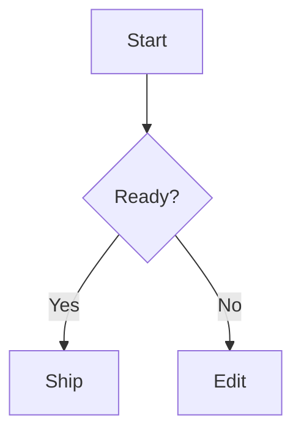

# Plan: Mermaid Diagram Block Type

## Decisions

- Add a first-class `mermaid` block type.
- Store Mermaid source in normal block text content.
- Do not add Mermaid-specific document metadata.
- Keep view/edit mode as local UI state, initialized to edit mode.
- Use the official `mermaid` package for rendering.
- Do not add Mermaid syntax highlighting in edit mode.
- Do not add fenced Mermaid markdown shortcuts in this pass.
- `Enter` in Mermaid blocks inserts a newline.
- At the end of a Mermaid block, pressing `Enter` after two trailing blank lines exits to a following paragraph.
- `Tab` in Mermaid blocks should match code blocks and insert four spaces.

## Phase 1: Dependency And Data Model

1. Add the official Mermaid package to the block rich text example.
   - Update `examples/block-rich-text/package.json`.
   - Update the lockfile with the repo's package manager.

2. Extend `RichBlockMeta`.
   - File: `examples/block-rich-text/src/blockMeta.ts`
   - Add `{type: 'mermaid'; ts: HLC}` to the union.
   - Add a `sameTypeWithTs` branch for `mermaid`.

3. Extend document import/export.
   - File: `examples/block-rich-text/src/documentFormat.ts`
   - Add `mermaid` to `BLOCK_TYPES`.
   - Add a `parseMeta` branch that accepts no metadata, matching other no-meta blocks.
   - Add a `richMetaForDocumentBlock` branch.
   - Add a `documentBlockForMeta` branch.

## Phase 2: Block Type Creation Surfaces

1. Add Mermaid to the slash command menu.
   - File: `examples/block-rich-text/src/App.tsx`
   - Add `mermaid` to `BlockTypeMenuValue`.
   - Add a `SLASH_COMMANDS` entry, probably label `Mermaid diagram`, keywords `diagram`, `chart`, `flowchart`, `mermaid`.

2. Add Mermaid to the toolbar block type select.
   - File: `examples/block-rich-text/src/App.tsx`
   - Add an `<option value="mermaid">Mermaid diagram</option>`.

3. Wire block type conversion/display.
   - File: `examples/block-rich-text/src/App.tsx`
   - Add `blockTypeMeta('mermaid', ...) => {type: 'mermaid', ts}`.
   - Add `blockTypeMenuValue` handling for `meta.type === 'mermaid'`.

## Phase 3: Editing Behavior

1. Generalize code-like plain text behavior.
   - File: `examples/block-rich-text/src/App.tsx`
   - Introduce a helper or local boolean for code-like editable blocks:
     - `meta.type === 'code' || meta.type === 'mermaid'`
   - Use it for:
     - monospaced/code-like editor class
     - trailing newline sentinel support
     - `Tab` inserting four spaces
   - Keep syntax highlighting limited to `code`.

2. Add Mermaid-specific split behavior.
   - File: `examples/block-rich-text/src/blockCommands.ts`
   - In `splitBlock`, branch on `currentMeta?.type === 'mermaid'`.
   - If the caret is at the end and the content ends with two blank lines, exit the Mermaid block.
   - Otherwise insert `\n` into the current block and return the updated caret.

3. Implement two-blank-line exit.
   - Add a `shouldExitMermaidBlock(state, point)` helper.
   - Interpret "two blank lines" as content ending in `\n\n` with the caret at the block end.
   - Reuse `exitCodeBlock` only if the desired cleanup matches:
     - It removes one trailing newline before creating the following paragraph.
     - For Mermaid, confirm whether the block should retain one trailing newline or remove both.
   - Preferred behavior: remove one of the two final newlines and create an empty paragraph after the Mermaid block, leaving the Mermaid source without an extra blank final line.

4. Keep multiline paste inside Mermaid blocks.
   - File: `examples/block-rich-text/src/blockCommands.ts`
   - Update `pastePlainTextAtBlockEnd` so Mermaid joins code in skipping the optimized line-to-block paste path.

## Phase 4: Mermaid View/Edit UI

1. Add a `MermaidBlock` component.
   - File: `examples/block-rich-text/src/App.tsx`
   - Props should include:
     - block id
     - source text
     - edit surface React element
   - Keep local state:
     - `const [mode, setMode] = useState<'edit' | 'view'>('edit')`

2. Render Mermaid blocks through the wrapper.
   - File: `examples/block-rich-text/src/App.tsx`
   - In `EditableBlock`, wrap Mermaid blocks similarly to image/preview:
     - Top toolbar with `Edit` / `View` toggle.
     - Edit mode shows `editableSurface`.
     - View mode shows non-editable rendered output.
   - Ensure toolbar controls use `stopEditorControlEvent` to avoid disturbing editor selection.

3. Render diagrams in view mode.
   - Use Mermaid's browser API in a `useEffect`.
   - Make rendering stale-safe:
     - Track a cancelled flag or render sequence.
     - Ignore async results after unmount or source changes.
   - Use a deterministic unique id derived from block id.
   - Display rendering errors inside the block instead of throwing.
   - Ensure rendered content is `contentEditable={false}`.

4. Mermaid initialization.
   - Initialize Mermaid once with a restrained configuration.
   - Suggested options:
     - `startOnLoad: false`
     - `securityLevel: 'strict'` unless rendering requirements force otherwise.
   - Avoid global repeated initialization on every render.

## Phase 5: Styling

1. Add Mermaid editor and preview styles.
   - File: `examples/block-rich-text/src/style.css`
   - Add classes:
     - `.mermaidBlock`
     - `.mermaidToolbar`
     - `.mermaidModeToggle`
     - `.mermaidEditor`
     - `.mermaidPreview`
     - `.mermaidError`

2. Keep layout consistent with existing block rows.
   - Edit mode should feel like a code block.
   - View mode should allow horizontal overflow for wide diagrams.
   - Toggle should be compact, top-aligned, and not resize the row awkwardly.

3. Check mobile behavior.
   - Ensure the wrapper fits in the existing mobile `.blockRow` grid.
   - Ensure toggle text does not overflow.

## Phase 6: Tests

1. Add command tests.
   - File: `examples/block-rich-text/src/blockCommands.test.ts`
   - Test `Enter` inserts newline inside Mermaid blocks.
   - Test Mermaid does not split on a single trailing blank line.
   - Test Mermaid exits to a paragraph after two trailing blank lines.
   - Test multiline paste stays inside one Mermaid block.

2. Add document format tests.
   - File: `examples/block-rich-text/src/documentFormat.test.ts`
   - Test import/export round-trip for:

```json
{"type": "mermaid", "content": "graph TD\nA-->B"}
```

3. Add UI/component tests if practical.
   - File: `examples/block-rich-text/src/App.test.tsx`
   - Test Mermaid blocks start in edit mode.
   - Test the toggle can switch to view mode.
   - Test invalid Mermaid source shows an error state rather than crashing.

4. Run focused tests first, then the example build.
   - Focused tests:
     - `npm exec vitest -- examples/block-rich-text/src/blockCommands.test.ts examples/block-rich-text/src/documentFormat.test.ts`
   - Build:
     - `npm run build --workspace` if the repo has workspace scripts, otherwise run the example's build from `examples/block-rich-text`.

## Phase 7: Manual Verification

1. Start the example dev server.
2. Create a Mermaid block from:
   - toolbar block type select
   - slash command menu
3. Confirm new Mermaid blocks start in edit mode.
4. Type:



5. Confirm:
   - `Enter` adds newlines inside the Mermaid block.
   - `Tab` inserts four spaces.
   - one trailing blank line does not exit.
   - two trailing blank lines exits to a paragraph.
   - `View` renders the diagram.
   - invalid Mermaid text shows an inline error.
   - toggling back to `Edit` preserves source content.
   - import/export still works for existing block types.

