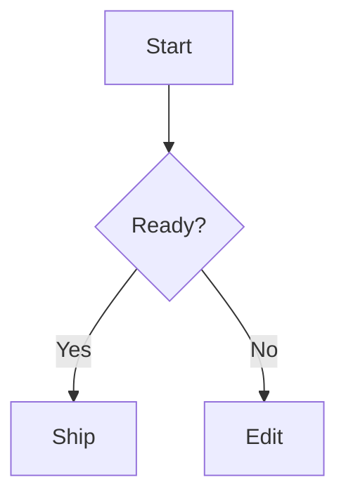

# Research: Mermaid Diagram Block Type

## Goal

Add a `mermaid diagram` block type to `examples/block-rich-text`.

Requirements from `task.md`:

- Block content is the Mermaid diagram config/source text.
- Editing behavior should be similar to `code` blocks.
- `Enter` should insert a newline instead of splitting the block.
- The top of the block should include a toggle between `view` and `edit` modes.
- Mermaid blocks should start in edit mode.

## Current Architecture

The block rich text example stores block semantics in `RichBlockMeta`:

- File: `examples/block-rich-text/src/blockMeta.ts`
- Existing metadata union includes `paragraph`, `heading`, `list_item`, `todo`, `blockquote`, `code`, `callout`, `recipe_ingredient`, `table`, `image`, and `preview`.
- `code` is currently `{type: 'code'; language: string; ts: HLC}`.

Document import/export has its own whitelist and metadata parser:

- File: `examples/block-rich-text/src/documentFormat.ts`
- `DocumentBlockType = RichBlockMeta['type']`.
- `BLOCK_TYPES` must include every importable/exportable block type.
- `parseMeta`, `richMetaForDocumentBlock`, and `documentBlockForMeta` all switch over block type.
- Code blocks currently round-trip as `{type: 'code', meta: {language}}`.

The UI renders formatted blocks in `EditableBlock` inside:

- File: `examples/block-rich-text/src/App.tsx`
- `EditableBlock` builds a shared `editableSurface` using `RichTextEditableSurface`.
- Code blocks add `codeBlock` styling, syntax highlighting, trailing-newline handling, and special keyboard handling.
- Image and preview blocks wrap `editableSurface`; other blocks render it directly.
- `BlockInlineControls` renders extra controls for code language, callout kind, and image size.

Block type selection exists in two places:

- Toolbar select: `EditorToolbar` options in `App.tsx`.
- Slash command menu: `SLASH_COMMANDS` in `App.tsx`.
- The conversion logic is `blockTypeMeta`.
- Current selection display is `blockTypeMenuValue`.

## Existing Code Block Behavior To Reuse

Keyboard behavior is split between UI and command logic:

- `EditableBlock` intercepts `Enter` in `App.tsx`.
- It calls `onSplit()`.
- `splitBlock` in `examples/block-rich-text/src/blockCommands.ts` handles code blocks specially.

Current code behavior:

- `Enter` in a code block usually inserts `\n`.
- `Enter` at a trailing blank line exits the code block into a paragraph.
- `Shift+Enter` forces a newline even at the exit condition.
- `Tab` inside code inserts four spaces.
- Pasting multiline plain text at the end does not use the optimized multi-block paste path for code blocks.

Relevant tests:

- `examples/block-rich-text/src/blockCommands.test.ts`
- Existing tests cover newline insertion, code-block exit on trailing blank line, and forced newline.

For Mermaid, the task explicitly says `Enter` adds a newline instead of splitting. It does not mention the code block trailing-blank-line exit behavior, so the safest interpretation is:

- Mermaid `Enter` should always insert a newline.
- Mermaid should not exit into a paragraph on a trailing blank line unless the user confirms they want code's exit behavior too.
- `Shift+Enter` can behave the same as `Enter`.
- `Tab` should probably match code blocks and insert four spaces.

## Mermaid Block Data Model

Recommended block metadata:

```ts
| {type: 'mermaid'; ts: HLC}
```

Reasoning:

- The Mermaid source/config should live in normal block text content, just like code block content.
- There is no obvious per-document metadata in the requirement.
- View/edit mode is an editor presentation state, not document content, unless users expect collaborators or exports to preserve the current mode.

Required metadata changes:

- Add `mermaid` to `RichBlockMeta`.
- Add a `sameTypeWithTs` branch.
- Add `mermaid` to `BLOCK_TYPES`.
- Add `parseMeta`, `richMetaForDocumentBlock`, and `documentBlockForMeta` branches.
- Add `mermaid` to `BlockTypeMenuValue`, `SLASH_COMMANDS`, toolbar options, `blockTypeMeta`, and `blockTypeMenuValue`.

## Rendering Approach

Likely dependency:

- Add `mermaid` to `examples/block-rich-text/package.json`.
- Use Mermaid's browser API from React when a Mermaid block is in `view` mode.

Suggested UI shape:

- Render Mermaid blocks as a wrapped block, similar to image/preview:
  - Top row with a segmented toggle: `Edit` and `View`.
  - Edit mode shows `RichTextEditableSurface` with code-like styling.
  - View mode shows a non-editable Mermaid render surface.
- Start mode should be edit. This can be implemented by keeping local state defaulted to edit in a `MermaidBlock` component.

State location options:

- Local component state keyed by block id: simple and consistent with "Start in edit mode".
- Metadata-backed mode: replicated but adds collaboration semantics not requested.
- App-level map: useful if mode should survive React unmount/remount during local editing, but still not exported.

Recommended first pass:

- Local state in `MermaidBlock`, initialized to `'edit'`.
- If remount resets are annoying during block movement or large rerenders, promote to an App-level `Map<string, 'edit' | 'view'>`.

Rendering details to handle:

- Mermaid render should be asynchronous and cancellable/stale-safe in `useEffect`.
- Use a deterministic id derived from block id plus a render counter or sanitized block id.
- Show invalid Mermaid source as an error message in the view surface, not as a thrown React error.
- Ensure rendered SVG is not content-editable.
- Avoid using `dangerouslySetInnerHTML` unless Mermaid's API only returns an SVG string; if used, keep it scoped to Mermaid output and no arbitrary HTML from user text.

## Keyboard And Editing Changes

`splitBlock` should treat `mermaid` separately from `code`.

Suggested command behavior:

- For `currentMeta?.type === 'mermaid'`, insert `\n` and return a caret after the inserted newline.
- Do this before normal `splitBlockOps`.
- Do not call `shouldExitCodeBlock`.

UI keyboard behavior:

- In `EditableBlock`, include Mermaid anywhere code gets editor-like text behavior:
  - `Enter`: insert newline via `onSplit`.
  - `Tab`: insert four spaces.
  - `codeBlock` class or a new `mermaidEditor` class for monospaced text.
  - trailing newline sentinel if needed, because Mermaid content can also end in `\n`.

Potential implementation detail:

- Rename local booleans to something like `isPlainTextCodeLikeBlock = meta.type === 'code' || meta.type === 'mermaid'`.
- Keep syntax highlighting only for `code`; Mermaid edit mode probably should not use highlight.js unless a Mermaid language mode is added.

## Clipboard, Paste, And Markdown Shortcuts

Paste behavior has a code-specific guard:

- `pastePlainTextAtBlockEnd` skips optimized line-to-block paste when `block.meta.type === 'code'`.

Mermaid should also skip that path, so multiline paste stays inside one Mermaid block.

Markdown shortcuts:

- Existing shortcuts do not create code blocks from fenced code.
- No Mermaid markdown shortcut is required by the task.
- Optional future enhancement: convert a Mermaid fenced block or `/mermaid` command into a Mermaid block.

## Styling

Existing relevant styles:

- `.codeBlock` gives monospaced, bordered, pre-wrap text surface.
- `.codeLanguage`, `.calloutKind`, and `.imageSizeControl` style inline block controls.
- Mobile CSS moves block inline controls under the editor.

Suggested classes:

- `.mermaidBlock`
- `.mermaidToolbar`
- `.mermaidModeToggle`
- `.mermaidEditor`
- `.mermaidPreview`
- `.mermaidError`

Design notes:

- The toggle should be inside the block, at the top, and `contentEditable={false}`.
- Buttons should call `stopEditorControlEvent` on pointer/mouse/click events to avoid stealing or corrupting editor selection.
- Edit mode can reuse `.codeBlock` styles plus Mermaid-specific class.
- View mode should have a bordered neutral surface with enough padding and horizontal overflow for wide diagrams.

## Tests To Add Or Update

Recommended unit tests:

- `blockCommands.test.ts`
  - `splitBlock` inserts newline inside Mermaid blocks.
  - `splitBlock` does not exit Mermaid blocks on a trailing blank line.
  - Multiline paste into Mermaid remains in one block.
- `documentFormat.test.ts`
  - Import/export round-trips `{type: 'mermaid', content: 'graph TD\nA-->B'}`.
  - Unknown metadata for Mermaid is either ignored consistently or rejected consistently with existing no-meta block types.

Recommended component tests, if feasible with existing test setup:

- Mermaid block starts in edit mode.
- Toggle switches to view mode.
- Invalid Mermaid source shows an error instead of crashing.

Manual verification:

- Use `/mermaid` or toolbar selection to create a Mermaid block.
- Type:



- Press `Enter` several times and confirm no new blocks are created.
- Toggle to view and confirm a diagram renders.
- Toggle back to edit and confirm content is retained.

## Open Questions

1. Should view/edit mode be local UI state, replicated CRDT metadata, or exported document state?
   - Recommendation: local UI state. The task says "Start in edit mode" and does not say mode is document content.

- local UI state

2. Should Mermaid blocks support code's trailing blank line exit behavior?
   - Recommendation: no. The task specifically says `Enter` adds a newline instead of splitting the block.

- let's do two blank lines to exit

3. Should Mermaid blocks have a language/control field like code blocks?
   - Recommendation: no. Mermaid source is inherently Mermaid.

- no

4. Should Mermaid rendering be added via the official `mermaid` package, or should the example avoid a new dependency?
   - Recommendation: use the official package. Rendering Mermaid correctly by hand is not practical.

- yup official

5. Should Mermaid source be syntax-highlighted in edit mode?
   - Recommendation: not in the first pass unless the chosen highlighter already supports Mermaid cleanly. Monospace editing is enough for the requirement.

- let's not bother

6. Should slash markdown shortcuts support fenced Mermaid code blocks?
   - Recommendation: defer. Add the explicit block type first.

- defer
