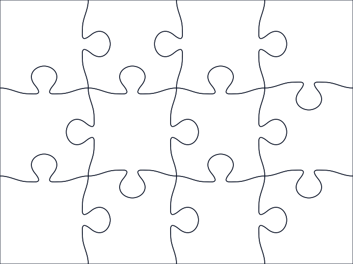
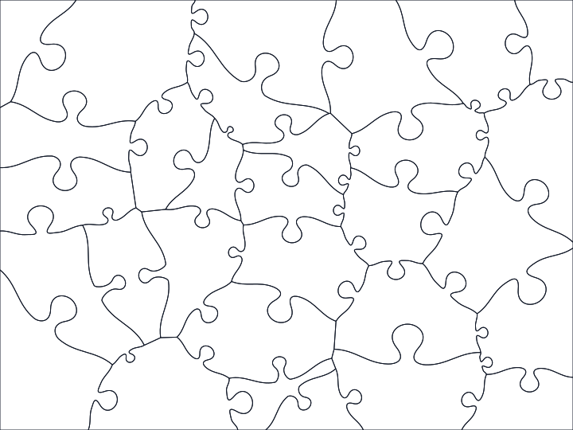

# Jigsaw

Pure jigsaw board generation and SVG outline utilities.

This directory owns the reusable generation code for rectangular and Voronoi jigsaw boards, including tabbed pieces and torus surfaces. It deliberately does not include gameplay behavior such as dragging, snapping, packing, collaboration, or React rendering.

## Generate An SVG

From the repository root:

```sh
bun src/jigsaw/jigsaw-board-svg.ts '{"pieceCount":12,"tabs":true,"seed":"readme","stroke":"#0f172a","strokeWidth":1.5}' src/jigsaw/readme-example.svg
```

After the package is built or installed, the same CLI is exposed as:

```sh
jigsaw-board-svg '{"pieceCount":12,"tabs":true,"seed":"readme","stroke":"#0f172a","strokeWidth":1.5}' readme-example.svg
```

## Example





## Library Usage

```ts
import {generateJigsawBoard, jigsawBoardToSvg} from 'umkehr/jigsaw';

const board = generateJigsawBoard(30, {
    type: 'voronoi',
    tabs: true,
    seed: 'example',
});

const svg = jigsawBoardToSvg(board, {
    title: '30 piece Voronoi example',
    strokeWidth: 1.5,
});
```
